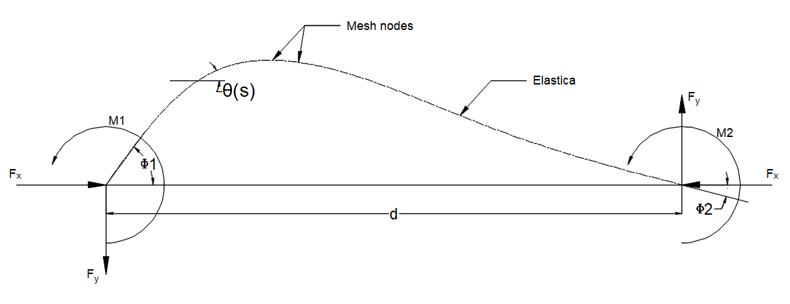

About elastica\_model
======================

``elastica_model`` is a Python library for computing and cataloguing
equilibrium configurations of a **clamped-clamped inextensible elastica**
— a flexible beam with both ends rigidly clamped at a prescribed
separation distance.

The library drives `AUTO-07p <https://auto07p.github.io>`_ continuation
software to trace solution branches, parses the output into a compact
**HDF5** database, and builds an **R-tree** spatial index for fast lookup
by boundary angles and d.

----

Physical Problem
----------------

A uniform, inextensible elastic rod of unit length is clamped at both ends.
The clamps are separated by distance :math:`d`.  

The following variables fully characterise each equilibrium configuration:

.. list-table::
   :widths: 20 80
   :header-rows: 1

   * - Variable
     - Description
   * - :math:`d`
     - Clamp-to-clamp distance (normalised by rod length).
       Ranges from 0 (fully folded) to 1 (straight rod).
   * - :math:`\phi_1`
     - Tangent angle of the rod at the **left** clamp (boundary condition).
   * - :math:`\phi_2`
     - Tangent angle of the rod at the **right** clamp (boundary condition).
   * - :math:`F_x`
     - Horizontal reaction force.
   * - :math:`F_y`
     - Vertical reaction force.
   * - :math:`M1`
     - Moment at left end.
   * - :math:`M2`
     - Moment at right end.
   * - :math:`x_\text{tip}`
     - x-coordinate of the rod tip relative to the left clamp origin.
   * - :math:`y_\text{tip}`
     - y-coordinate of the rod tip relative to the left clamp origin.
   * - :math:`s`
     - arc length at mesh nodes
   * - :math:`\theta(s)`
     - tangent angle at mesh nodes

